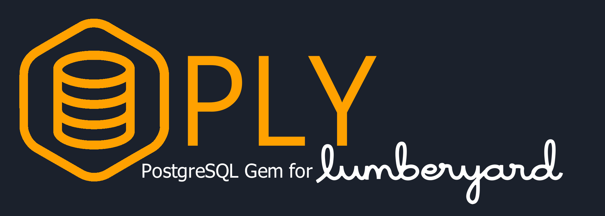

# PLY - PostgreSQL Gem for the Amazon Lumberyard Game Engine

## What is PLY?

PLY stands for "PostgreSQL for Lumberyard". While Amazon provides Gems (self contained packages) for connecting to databases on its AWS cloud services, PLY is a C++ based solution for connecting to your own self-hosted PostgreSQL database instances (either remotely or locally).

PLY provides a connection pool combined with a worker thread pool, which allows the simultaneous processing of multiple queries from a query queue. Results are returned to a results queue.

PLY is written specially for Lumberyard, allows easy setup and integration with Lumberyard projects, and includes database connection and query pool management via editor tools. It uses the Lumberyard event bus system (ebus) to take requests from other modules, and to return results. Example implementations are also provided (See the https://github.com/ash-j-f/CaelumMagnaVR-public repository).

## How does it work?

When activated by a call to the "InitialisePool" pool method, the PLY Gem spawns a number of worker threads equal to the "Minimum Pool Size" setting. A manager thread is also spawned. The manager thread monitors a query queue. When queries are added to the queue, the manager thread distributes the queries to available worker threads. If there are no available worker threads, the manager thread spawns new workers, up to the number specified by the "Maximum Pool Size" setting.
	
Worker threads each maintain their own permanent connection to the PostgreSQL database that is re-used for each new query. Once workers receive query results from the database, they place the results into the results queue and await the next query to be handed to them from the manager thread.
	
The host application is then (optionally) notified of returned results via the Lumberyard ebus system. Alternatively, the main thread can poll the results queue at its leisure.
	
This architecture allows for any number of queries to be added to a queue and then processed simultaneously and asynchronously, with the host application's main thread continuing uninterrupted until query results are ready.

## Version

This version of PLY is built using:
* libpqxx 6.4.5 (A C++ library for PostgreSQL) http://pqxx.org/development/libpqxx/
* Postgresql 11 and 12 (and associated DLLs) https://www.postgresql.org/
* Visual Studio 2017 https://visualstudio.microsoft.com/downloads/

## Installation

**To work with PLY, your project must be built using Visual Studio 2017.** Please refer to the Lumberyard documentation for configuring your project to use Visual Studio 2017 https://docs.aws.amazon.com/lumberyard/latest/userguide/lumberyard-launcher-using.html

Download this module and place it in a subdirectory named "PLY" in the (lumberyard)\dev\Gems\ directory.
	
Enable the Gem for your project using the Lumberyard Project Configurator (Click the "Enable Gems" link next to your project).
	
Ensure the gem is built correctly using the Lumberyard "lmbr_waf" build command, and that your Visual Studio solution is updated before running Lumberyard Editor.
	
### PostgreSQL DLLs
	
Third-party DLLs from PostgreSQL and Libpqxx are required and must be present in the same directory as your application's EXE.
		
To obtain the required DLLs from PostgreSQL, install PostgreSQL from https://www.postgresql.org/download/windows/ (use this provider if possible: https://www.enterprisedb.com/downloads/postgres-postgresql-downloads)
		
Note that you must use DLLs from either PostgreSQL versions 11 or 12.
		
Copy the following DLL files from the PostgreSQL directory (eg: C:\Program Files\PostgreSQL\11\bin) to your Lumberyard executable directory such as (lumberyard)\dev\Bin64vc141\
			
* libpq.dll
* libiconv-2.dll
* libwinpthread-1.dll
* libcrypto-1_1-x64.dll
* libssl-1_1-x64.dll
* libintl-8.dll (PostgreSQL 12 only)
			
### Libpqxx DLL
	
Versions of the Libpqxx DLL can be found in the PLY repository under:

(lumberyard)\dev\gems\PLY\External\Libpqxx\6.4.5(.PG11 or .PG12)\lib\libpqxx.dll
		
The version "libpqxxD.dll" must be used for debug builds. This version MUST be renamed to libpqxx.dll in the destination directory.
		
Copy the required DLL version to your Lumberyard executable directory such as (lumberyard)\dev\Bin64vc141\
		
*WARNING: Using the debug version for release builds, or vice versa, may cause unexpected errors.*
		
### Configuring your Lumberyard project
	
To use the PLY Gem, you must add the following to your project's wscript file.
		
Edit wscript at (lumberyard)\dev\(project name)\Gem\Code\wscript and add the following to the "bld.DefineGem" section:
*NOTE: This is required so your application can understand the Libpqxx query result sets returned by PLY*
```		
uselib = ['LIBPQ','LIBPQXX'],
```
			
## PLY Configuration

PLY configuration is set by using the PLYConfiguration.hpp singleton in C++, or by using the PLY Configuration Component in the Editor (see "PLY Configuration Component" below).
	
See PLYConfiguration.hpp for a complete list of options available in C++.
	
Eg:	
```
PLY::DatabaseConnectionDetails d;
d.port = 5432;
d.host = "localhost";
d.database = "testdatabase;
d.username = "testuser";
d.password = "testpassword";
d.connectTimeout = 60;
d.sslMode = PLY::DatabaseConnectionDetails::SSLMode::Prefer;
PLYCONF->SetDatabaseConnectionDetails(d);
```
*NOTE: The query worker pool must be de-initialised and re-initialised for config changes to take effect.*

## PLY Configuration Component

The PLY Configuration component MUST be added to a level for the PLY functionality to be made available through Editor and in your C++ code.
	
There should be no more than one PLY Configuration Component added to a level.

*NOTE: The query worker pool must be de-initialised and re-initialised for config changes to take effect.*

The following options are available on the component via the editor.

### Options
* Log Level - The level of log messages to display in console. Options are Error, Info, Warning, Debug.
* Port - The port number of the PostgreSQL database to connect to.
* Host - The host name (or IP address) of the database to connect to.
* Database - The name of the database to connect to.
* Username - The username to log into the database with.
* Password - The password to use for database login.
* Reconnect Wait Time (ms) - Time to wait before attemtpting to reconnect after an error (in milliseconds).
* Connection Timeout (s) - The time to wait for a connection attempt to succeed before aborting (in seconds).
* SSL Mode - The SSL connection encyption mode. Options are:
	* Allow - first try a non-SSL connection; if that fails, try an SSL connection, 
	* Disable - only try a non-SSL connection, 
	* Prefer - first try an SSL connection; if that fails, try a non-SSL connection, 
	* Require - only try an SSL connection, 
	* Verify CA - only try an SSL connection, and verify that the server certificate is issued by a trusted certificate authority (CA),
	* Verify Full - only try an SSL connection, verify that the server certificate is issued by a trusted CA and that the requested server host name matches that in the certificate.
* Min Pool Size - The minimum number of connection threads in the pool to pre-initialise on module start. This value should never be set lower than 1.
* Max Pool Size - The maximum number of connection threads to spawn in the pool. For best performance, this value should generally be set no higher than the maximum number of PHYSICAL CPU cores in the system (not to be confused with the count of LOGICAL cores, such as "virtual" cores created by hyperthreading). Benchmarking your application with different max pool size values will help determine the optimal value.
* Thread Wait Mode - The loop method for worker threads. Options are Sleep (thread waits 1ms before checking for new work items) and Yield (thread calls yield before checking for new work items). You will need to benchmark either option to determine which is best for your use-case.
* Manager Thread Priority - Process priority of the worker pool manager process. The manager thread is responsible for distributing work tasks to worker threads. Lower priority will reduce the worker thread's impact on CPU resources, but will cause PLY to hand new work items to worker threads at a slower rate on busy systems.
* Worker Thread Priority - Process priority of the worker threads in the pool. Worker threads connect to the PostgreSQL database and perform queries. Lower priority will reduce the worker threads impact on CPU resources, but will cause queries to be processed slower on busy systems.

## PLY Basics

Once the PLY Configuration Component is added to your level (essential), the worker pool can be started and queries can be sent.

*NOTE: any class working with the PLY Gem MUST include the following headers:*
```
#include <PLY/PLYTools.h>
#include <PLY/PLYTypes.h>
```

### Starting the Worker Pool
	
To start the query worker pool, use the PLY Request bus PLY/PLYRequestBus.h call "InitialisePool".
```
eg: PLY::PLYRequestBus::Broadcast(&PLY::PLYRequestBus::Events::InitialisePool);
```
This will spawn the minimum number of worker threads. Each thread will establish a permanent connection to the database which it will re-use for each query.
		
More worker threads will be spawned (up to the chosen maximum count) if required, as queries are sent to the query queue.
		
### Stopping the Worker Pool
	
To stop the query worker pool, use the PLY Request bus PLY/PLYRequestBus.h call "DeInitialisePool".
```	
eg: PLY::PLYRequestBus::Broadcast(&PLY::PLYRequestBus::Events::DeInitialisePool);
```
This will instruct each worker thread to shut down once their current query task has completed.
		
### Sending Queries (simple)

The query worker pool must be initialised for queries to be processed.
	
To send a query, use the PLY Request bus PLY/PLYRequestBus.h call "SendQuery".
		
eg:
```	 
unsigned long long queryID = 0;
PLY::PLYRequestBus::BroadcastResult(queryID, &PLY::PLYRequestBus::Events::SendQuery, "select * from users");
```

Queries are added immediately to a query queue, which is monitored by the manager thread, and queries are processed by the worker threads in the pool.
		
The SendQuery function optionally returns the queryID, which is required for identifying the results for this query in the results queue.
		
### Sending Queries (with options)
	
Queries may be sent with additional options as follows.
		
Using the PLY Request bus PLY/PLYRequestBus.h call "SendQueryWithOptions", the following options may be specified for a query.

eg: 
```
unsigned long long queryID = 0;
QuerySettings qs;
qs.queryTTL = 600000;
qs.resultTTL = 600000;
qs.advertiseResult = true;
PLY::PLYRequestBus::BroadcastResult(queryID, &PLY::PLYRequestBus::Events::SendQueryWithOptions, "select * from users", qs);
```
#### Query Settings
		
The Query Settings struct is used to define settings for each query, and is passed to SendQueryWithOptions as the second parameter.
			
* advertiseResult (boolean) - Should the PLY module advertise query results via the query results bus? (Default: True).
* queryTTL (int) - Time (milliseconds) a query can remain in the query queue before being deleted automatically. 0 means no TTL is enforced (Default: 0).
* resultTTL (int) - Time (milliseconds) a query can remain in the results queue before being deleted automatically. 0 means no TTL is enforced (Default: 0).
* The SendQueryWithOptions function optionally returns the queryID, which is required for identifying the results for this query in the results queue.

### Getting Query Results
	
Query results can be retrieved from the results queue using the PLY Request bus PLY/PLYRequestBus.h call "GetResult".
		
eg: 
```
unsigned long long queryID = 123;
std::shared_ptr<PLY::PLYResult> result_set;
PLY::PLYRequestBus::BroadcastResult(result_set, &PLY::PLYRequestBus::Events::GetResult, queryID);
```
If the results for the given query ID are not yet available, the result set will be equal to nullptr.
				
Results are returned as Libpqxx pqxx::result objects. See https://libpqxx.readthedocs.io/en/6.4/a01127.html

### Receiving Query Results (automatically as an event via ebus)
	
If a query was sent with the option "advertiseResult" enabled (which is default when using the call "SendQuery"), results are received via the ebus PLYResultBus.h

For a class to receive results, it must derive from PLYResultBus, and connect to the bus on activation. The function ResultReady will be called for each result as it arrives in the results queue.

eg:
```
#include <PLY/PLYTools.h>
#include <PLY/PLYTypes.h>
#include <PLY/PLYRequestBus.h>
#include <PLY/PLYResultBus.h>
...
class MyCustomComponent
    : public AZ::Component, 
    protected PLY::PLYResultBus::Handler
{
...
protected:
    void ResultReady(const unsigned long long queryID) override;
...
void MyCustomComponent::ResultReady(const unsigned long long queryID)
{
    std::shared_ptr<PLY::PLYResult> r;
    PLY::PLYRequestBus::BroadcastResult(r, &PLY::PLYRequestBus::Events::GetResult, queryID);
    if (r != nullptr)
    {
        if (r->errorType == PLY::PLYResult::ResultErrorType::NONE && r->resultSet.size() > 0)
        {
            for (auto &row : r->resultSet)
	    {
                if (row.size() != 3)
                {
                    AZ_Printf("Query Error", "%s", "Incorrect number of columns returned for row.");
                    continue;
                }
                //Print data as strings to console.
                AZ_Printf("Query Result", "Column 1: %s, Column 2: %s, Column 3: %s", row[0].c_str(), row[1].c_str(), row[2].c_str());
            }
        }
    }
}
```
Results are returned as Libpqxx pqxx::result objects. See https://libpqxx.readthedocs.io/en/6.4/a01127.html
			
### Removing Query Results

Query results will remain in the queue until their chosen TTL (Time To Live) expires, or they are explicitly removed.
		
To explicitly remove a result from the queue, use the PLY/PLYRequestBus.h call "RemoveResult".
```
eg: PLY::PLYRequestBus::Broadcast(&PLY::PLYRequestBus::Events::RemoveResult, queryID);
```
*NOTE: PLY query results are shared pointers, so a result will remain accessible in memory until all references to the shared pointer are deleted, even once the result is removed from the results queue.*

## Object Serialisation
	
PLY includes the PLYObjectSyncComponent (PLYObjectSyncComponent class), which allows for automatic serialisation of object data and storage of that data in the database. The data can then be retrieved to restore an object's state at any time.
		
For an example implementation of object serialisation using PLY, see the repository https://github.com/ash-j-f/CaelumMagnaVR-public.
		
The PLYObjectSyncComponent must be added to each Lumberyard game entity you want to save to, or load from, the database. The component can be added via the Lumberyard Editor.
		
A call must be made via the PLY/PLYRequestBus.h ebus to "InitialisePool" on level startup before serialisation queries will be processed.
```		
eg: PLY::PLYRequestBus::Broadcast(&PLY::PLYRequestBus::Events::InitialisePool);
```
The PLYObjectSyncComponent has the following configurable options:

* Object ID (int) - A unique object ID used to identify the object in the database and in the level. The same ID must be used to save and load the object.
* Table Name (string) - The name of the table in the database used to store object information.
* ID Column Name (string) - The name of the column used to store the unique object ID. The column in the database must be of "integer" type and must be the PRIMARY KEY (and must NOT allow duplicates).
* Data Column Name (string) - the name of the column used to store the serialised object data. The column in the database must be of "text" type.
* Update Frequency - Either "Never" (object will only serialise and save to database when "Save" is called on the component, or "User Defined" (object will serialise and save to database automatically every X milliseconds as configured by the "Frequency" option below).
* Frequency (integer) - The frequency to automatically serialise and save object data, if "User Defined" is chosen as the Update Frequency type (see above).

### Serialisation Methods

To serialise and de-serialise data, you must create a custom component attached to your object that inherits from the PLY/PLYObjectSyncDataStringBus.h ebus and implements the following functions:

```
void SetPropertiesFromDataString(std::string dataString) override;
```
This function must process the string returned from the database, de-serialising it and applying the object properties to the object.

```
std::string GetDataString() override;
```
This function must serialise chosen object properties to a string. This string is then saved in the database.
					
Be sure to connect your custom component to the PLYObjectSyncDataStringBus ebus on activation, so it can receive calls to SetPropertiesFromDataString and GetDataString.
```			
eg: PLY::PLYObjectSyncDataStringBus::Handler::BusConnect(GetEntityId());
```

It is suggested that you use the Amazon Lumberyard JSON tools to serialise and de-serialise the data in a format suitable for database storage as a string.
			
The following headers should be included to access the required JSON parsing functions:
```			
#include <AzCore/JSON/rapidjson.h>
#include <AzCore/JSON/document.h>
#include <AzCore/JSON/pointer.h>
#include <AzCore/JSON/stringbuffer.h>
#include <AzCore/JSON/writer.h>
#include <AzCore/JSON/prettywriter.h>
```
See the Lumberyard Documentation and the file headers for further information on using the RapidJSON library.

### Saving Object Data

Object data can be saved to the database by using the PLYObjectSyncSaveLoadBus (a component bus) and calling Save.
```
eg: PLY::PLYObjectSyncSaveLoadBus::Event(GetEnetityId(), &PLY::PLYObjectSyncSaveLoadBus::Events::Save);
```
Alternatively, this process is called automatically if Update Frequency is set to "User Defined" on the component settings.
		
### Retrieving Object Data
		
Object data can be loaded from the database by using the PLYObjectSyncSaveLoadBus (a component bus) and calling Load.
```			
eg: PLY::PLYObjectSyncSaveLoadBus::Event(GetEnetityId(), &PLY::PLYObjectSyncSaveLoadBus::Events::Load);
```
### Getting Unique Database Object ID assigned to Entity
		
The unique database object ID set on the PLYObjectSyncComponent can be retrieved by using the PLYObjectSyncSaveLoadBus (a component bus) and calling GetObjectID.
eg: 
```
int objectID = 0;
PLY::PLYObjectSyncSaveLoadBus::EventResult(objectID, GetEnetityId(), &PLY::PLYObjectSyncSaveLoadBus::Events::GetObjectID);
```

### Other ebus methods

A number of other ebus methods are available for automatic object serialisation and synchronisation tasks.

See the following ebuses:

* PLYObjectSyncSaveLoadBus.h - A component bus to trigger save and load actions on an entity.
* PLYObjectSyncEntitiesBus.h - An EBusTraits bus to communicate with all sync-enabled Entities in the level.
* PLYObjectSyncDataStringBus.h - A component bus that implements the custom serialisation and de-serialisation methods for your application.

## Query Statistics Display
	
Query performance statistics can be displayed at intervals via the Lumberyard console.

Statistics displayed include the number of queries sent per second, the number of results received per second, and the maximum number of busy worker threads since the last stats printout.

To enable stats display, type the following command into the Lumberyard console.
```		
ply stats start
```
To stop the stats display, type the following command:
```
ply stats stop
```
To configure the stats display frequency (where the number is in seconds between stat printouts), type the following command:
```
ply set stats_interval 5
```

## Credits

PLY was created by Ashley Flynn https://ajflynn.io/ while studying a degree in software engineering at the Academy of Interactive Entertainment and the Canberra Institute of Technology in 2019.
	
Special thanks to Dr. Coryn Bailer-Jones for providing star survery distance estimate data which was used in the Star Map demonstration project that implements the PLY Gem http://www2.mpia-hd.mpg.de/homes/calj/gdr2_distances/main.html
	
And special thanks also go to Josh Beacham for assistance with Amazon Lumberyard code and setup.
	
## License

PLY is licensed under the GNU General Public License v3.0. See the file "LICENSE" for more details.
